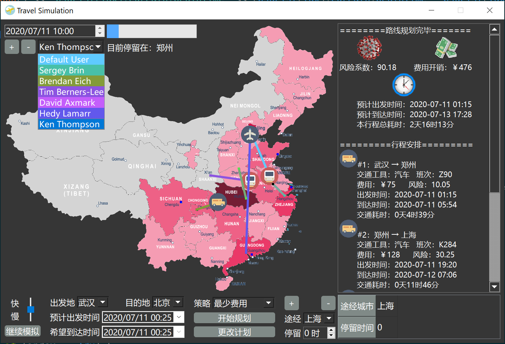

# Travel-Emu
北邮数据结构课程设计：低风险旅行模拟系统

## 环境
- C++ 11
- Qt 5.14
- Qt Creater

## 功能概述
2020年，新型冠状病毒肆虐，本低风险旅行模拟软件系统旨在模拟旅行的真实环境，根据旅客需求设计不同方案的路径，满足旅客的特定旅行要求，同时采用图形界面模拟出旅客当前所在城市、状态等，生动展现疫情下旅客的行动规划。
城市之间有各种交通工具（汽车、火车和飞机）相连，有些城市之间无法直达，需要途径中转城市。某旅客于某一时刻向系统提出旅行要求。考虑在当前COVID-19疫情环境下，各个城市的风险程度不一样，分为低风险、中风险和高风险三种。系统根据风险评估，为该旅客设计一条符合旅行策略的旅行线路并输出；系统能查询当前时刻旅客所处的地点和状态（停留城市/所在交通工具）

## 任务需求
### 软件数据
-	城市总数不少于10个。我们选择12个城市爬取数据：
“北京", "上海", "广州" , "深圳", "成都", "杭州", "重庆", "武汉", "南京", "郑州", "西安", "青岛”
-	单位风险值分为低风险0.2、中风险0.5和高风险0.9三种（个数均不小于3个）
-	城市之间有三种交通工具：汽车、火车、飞机，风险值：汽车=2；火车=5；飞机=9。
-	建立汽车、火车和飞机的时刻表（航班表），我们选定12个城市之间523次航班表信息存储到本地，时刻表结构如下：
| 序号 | 航班号/车次 | 出发地 | 目的地 | 出发时间 | 耗时 | 价格 |
-	航班<10，火车<30数量限制：本系统设置只有“北上广深成”5个大型城市之间相互有航班，共10种航班，一共38个班次；此外有30种火车班次，数百种汽车班次。

### 用户查询
-	用户输入：出发城市、目的地城市、出发时间范围、途经城市和停留时间和旅行策略等。
-	旅行策略包括：
    1.	最少风险：无时间限制，风险最少
    2.	最少时间：时间最少
    3.	最少费用：无时间限制，费用最少
    4.	限时最少风险：在规定时间内风险最少
    5.	限时最少费用：在规定时间内费用最少

### 系统时间模拟
-	旅行模拟查询系统以时间为轴向前推移，每10秒左右向前推进1个小时，本系统用户可以调节系统运行速度。
-	旅行过程中不考虑城市内换乘交通工具所需时间；
-	系统时间精确到小时。
-	建立日志文件，对旅客状态变化和键入等信息进行记录。

### 拓展
-	用图形绘制地图，并在地图上实时反映出旅客的旅行过程。
-	多旅客
-	某旅客在旅行途中可临时更改旅行计划，系统做相应的操作。

## 实现情况
本系统实现了以下功能：
1.	以时间轴推进用户旅行进程，进度条显示当前进度，运行速度可调节
2.	高效且正确地计算5种策略
3.	用户随时随地变更计划的功能
4.	模拟进程可以随时暂停进行相关修改、添加用户等操作
5.	GUI地图实时且动态呈现旅客当前状态
6.	旅客在任意策略下自定义途经城市和停留时间
7.	实时展示用户当前乘坐交通工具状态、旅行位置
8.	当前旅客切换功能，同时切换界面展示的用户需求
9.	多旅客可同时采用不同策略、不同途径、不同时段，在同一时间、同一地图上动态模拟其路径

## 参考项目
- https://github.com/JmPotato/Travel_Simulation
- https://download.csdn.net/download/qq_42577260/11425681

## Future Works
- GUI鲁棒性
- 采用了DFS、Dijkstra、回溯等算法，效率仍较低